# 功能

对有权限分级的系统进行越权测试的工具。

提供了

- 未授权检测

- 垂直越权检测
- 水平越权字段检测
- burp项目导入后进行批量检测

功能。

# 使用方法

通常情况下，使用者拥有一个系统的两个账号，一个高权限账号，一个低权限账号。

登录任意权限账号，判断系统的**鉴权字段**，通常为以下三种：

- Cookie
- http请求头

- 某个字段值，如是get请求的session字段：`/?session=xxxxxxxxxxxxx`

该系统提供两个选项，起码要设置其中一个：

- SetLowAuth

  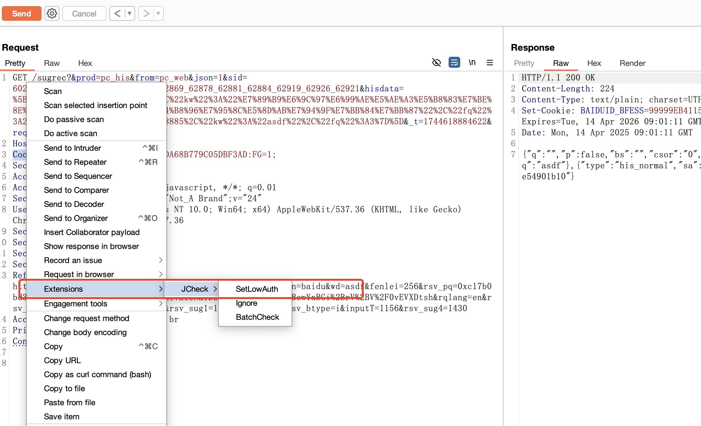

- 字符替换

  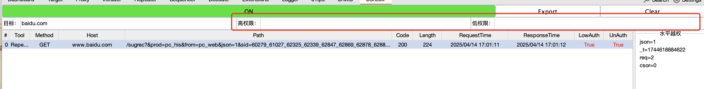

SetLowAuth的优先级>字符替换

## 基础越权测试：SetLowAuth

已www.baidu.com为例子，对于以下请求包

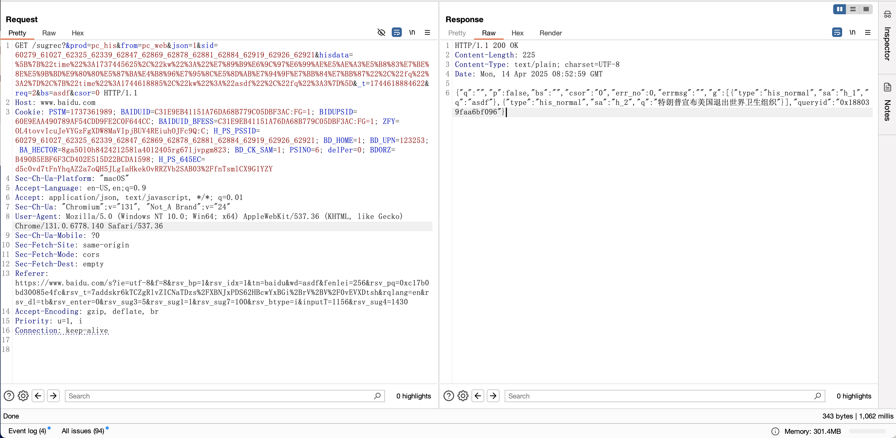

如果鉴权字段是Cookie。登录低权限账号，选中Cookie，右键选择 Extension->JCheck->SetLowAuth

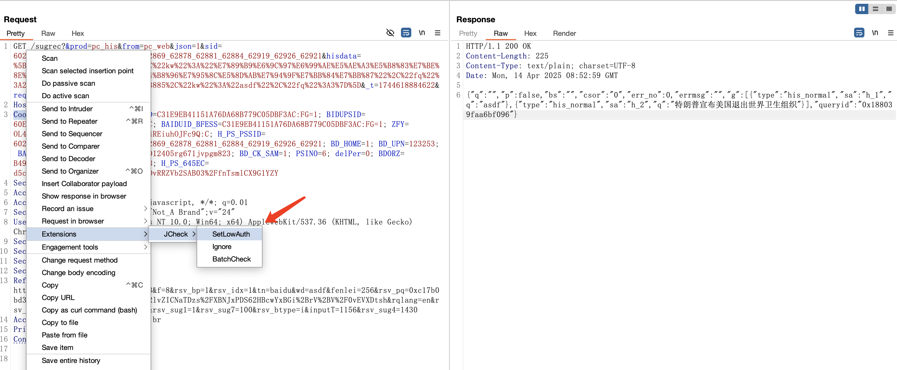

在 JCheck 面板设置目标为：www.baidu.com  （ 只要目标Host字段包含该字符串均会进行检测）

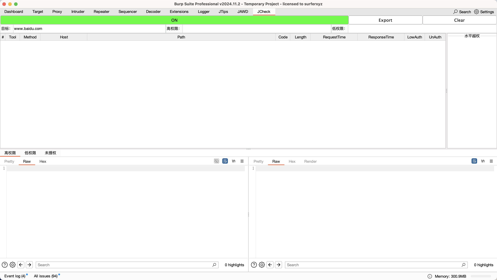

则，对于一个高权限请求（Cookie: BAIDUID=99999EB41151A76DA68B779C05DBF3AD;），如下

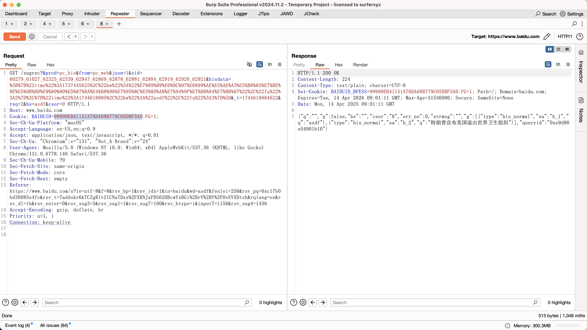

点击Send，可以看到 JCheck 面包出现了对应的请求日志

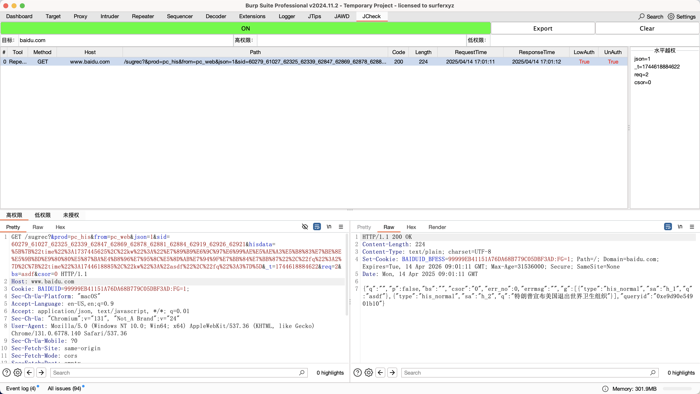

又因为高权限、低权限以及没有Cookie字段时返回的信息基本一致，所以判断路径`/sugrec`存在垂直越权和未授权，所以LowAuth和UnAuth字段为True

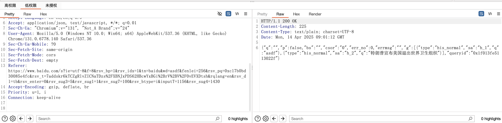

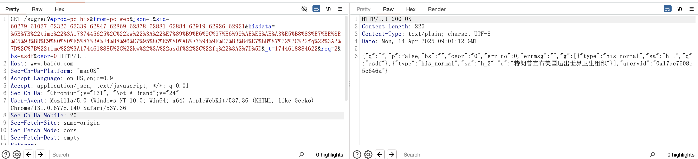

同时水平越权一栏会显示可能存在水平越权的参数

## 基础越权测试：字符替换

该功能最为简单，JCheck会将把请求书包中**低权限一栏的值**替换成高权限一栏的值。

对于以下路径为/pcag的请求包：

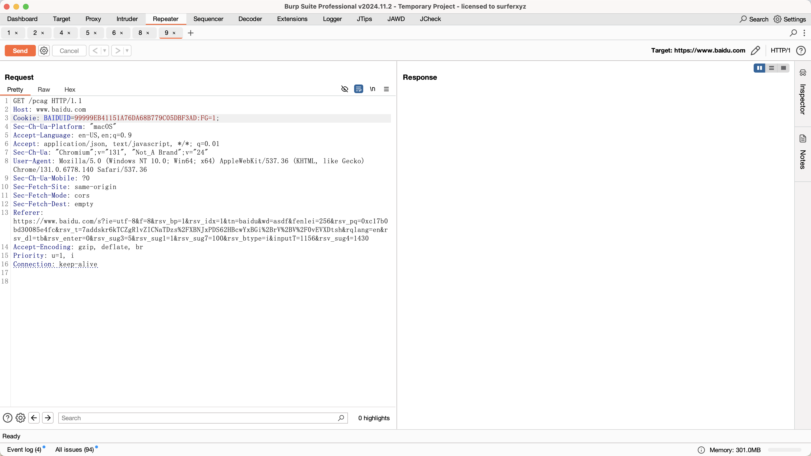

如果我们想替换`Sec-Fetch-Dest: empty`的empty，则填入

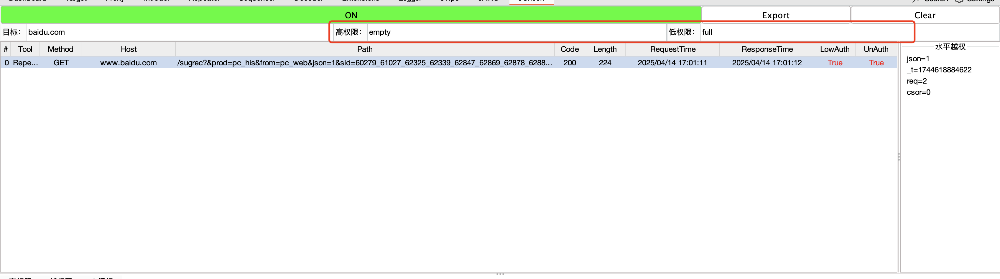

点击Send，可以看到日志捕获到了数据

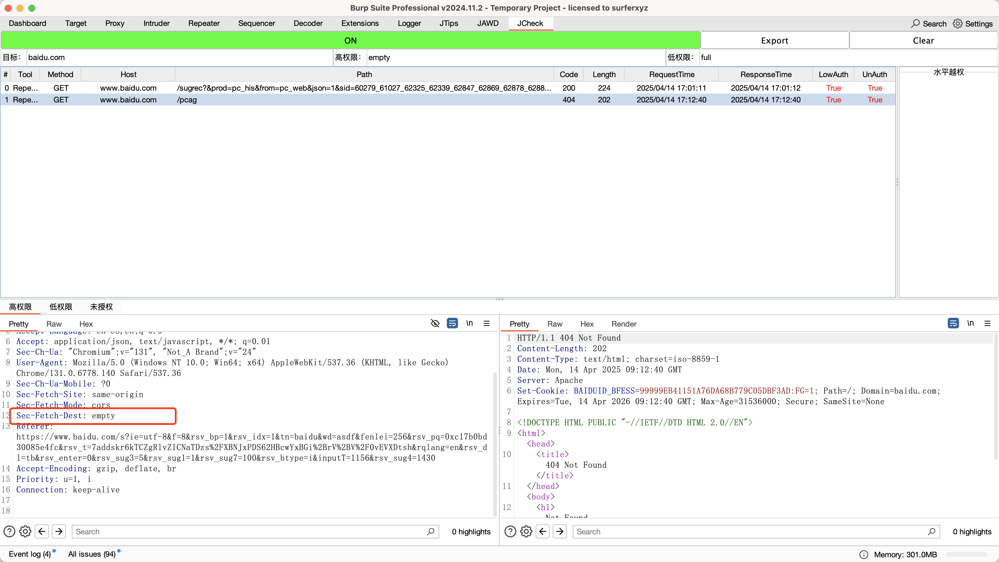

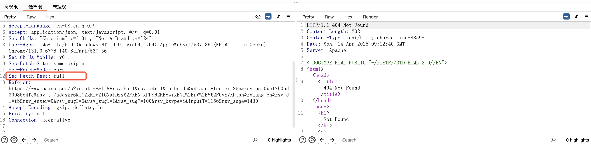

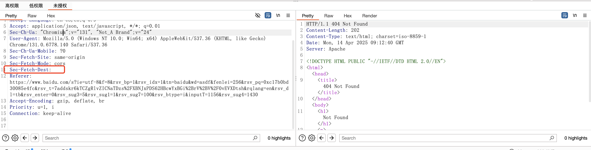

可以看到，对于待检测路径 `/pcag`，高权限的不变，低权限的为full，未授权的为空。

又因为高权限、低权限以及没有Cookie字段时返回的信息基本一致，所以判断为存在垂直越权和未授权，所以LowAuth和UnAuth字段为True

# 基础用法：鉴权字段是自定义请求头

对于以下数据包：

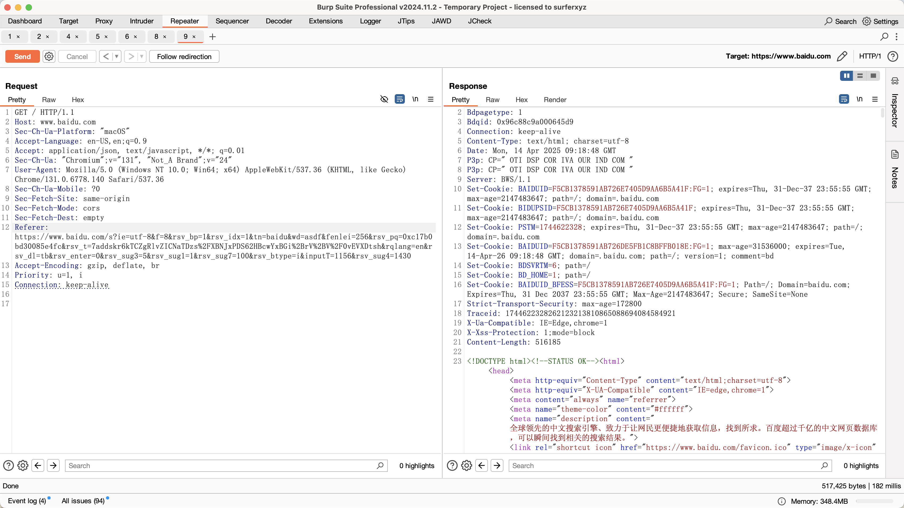

假设其鉴权字段是Referer，则登录低权限账号，

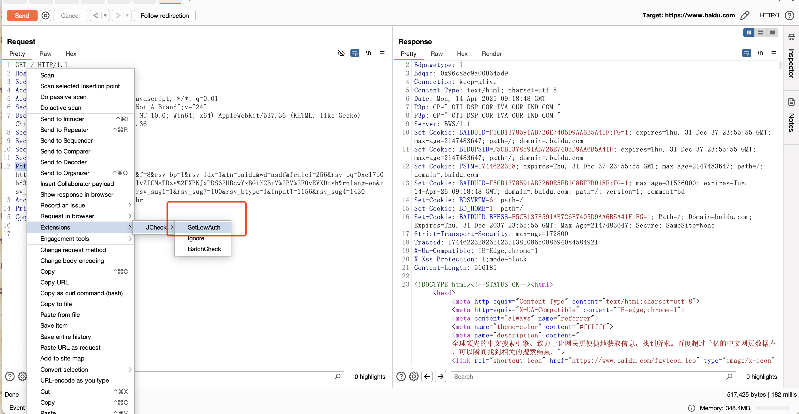

同样，选择Referer，设置为SetLowAuth。

则对于一个高权限账号的请求包（Referer：asdfa）：

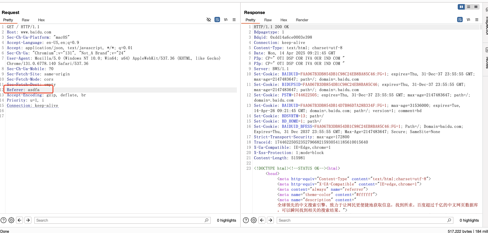

点击Send，可以看到 JCheck 面包捕获到了数据

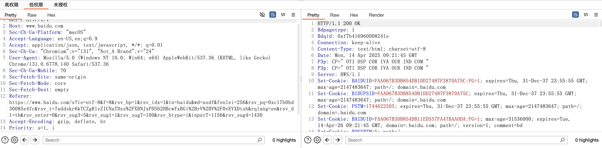

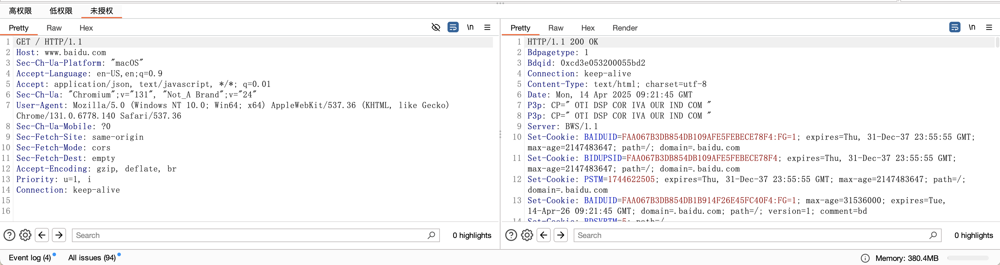

可以看到，对于待检测路径 `/`，高权限账号认证字段Refere不变，低权限账号的权限为其自己，未授权没有该字段。

又因为高权限、低权限以及没有Cookie字段时返回的信息基本一致，所以判断为存在垂直越权和未授权，所以LowAuth和UnAuth字段为True
